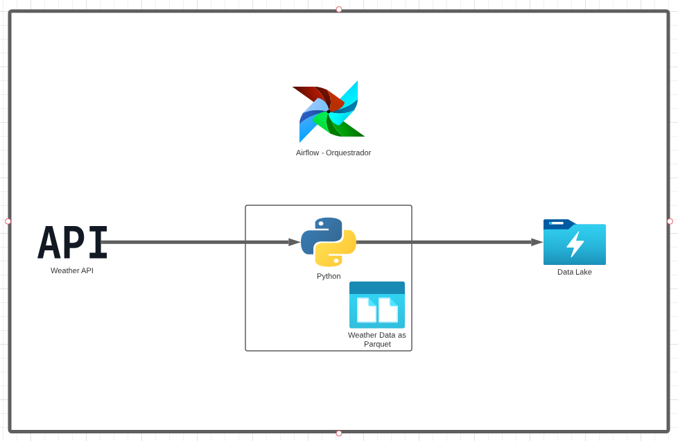
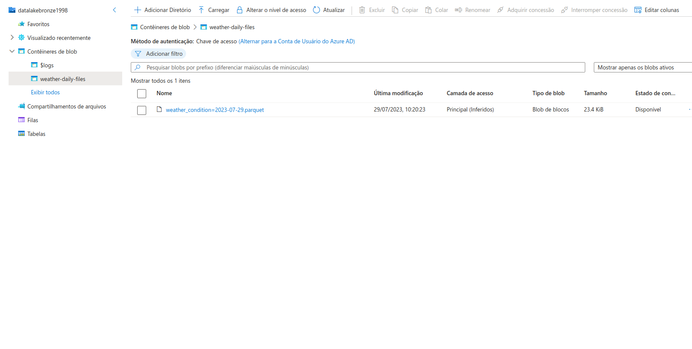
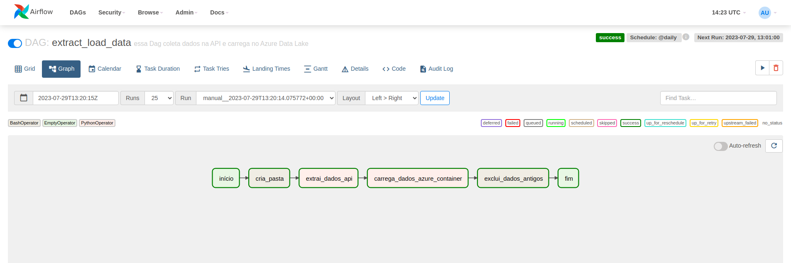
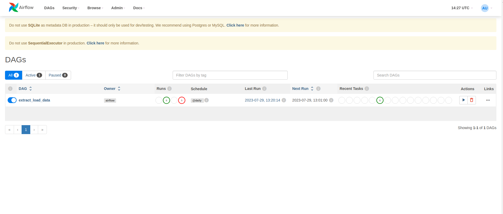

# Turismo SP
<b>Alerta:</b> Todas as premissas e problemas de negócio são ficticios e foram encaixados num problema de negócio muito comum no mundo de dados(disponibilizar dados para que modelos de ML sejam treinados).   
# Processo de Extração e Carga(EL) de Api para Datalake - Turismo São Paulo
Esse projeto é um pipeline de EL, feito com o objetivo de extrair dados de uma api e carregar os dados no Datalake da Azure por meio de uma orquestração de Airflow. 
  

## 1. Sobre a Turismo SP
Empresa do ramo de turismo que vende pacotes de viagens para a cidade de são paulo e que usa tecnologia para propiciar sempre os melhores passeis e rotas de visitas pela cidade.
  

### 1.1. Problema de Negócio
A empresa deseja criar um modelo de Machine Learning Capaz de selecionar os melhores passeios na cidade de são paulo com base no clima local, para isso é necessário extrair dados climáticos diariamente dos próximos 7 dias e disponibilizar em um ambiente no qual o Cientista de Dados da empresa possa utilizar os dados brutos para colocar em seu modelo.
  

## 2. Arquitetura proposta para Solucionar o problema
  

    

 

### 2.1. Extração de dados
A extração de dados é feita por meio de um Python Operator do Airflow. O código extrai os dados da previsão dos próximos 7 dias no formato csv e salva como parquet, formato otimizado para transporte de dados no Datalake. 
  

### 2.2. Ingestão de dados no Data Lake
Por meio de outro Python Operator, os dados salvos são enviados para o datalake.
  

    

### 2.3. Orquestração
Todo o Processo é Orquestrado no Airflow, por meio da DAG, ela tem periodicidade diária e fará a carga de dados necessária no datalake.
  

    

 

### 2.4. Dag no Airflow 
Essa é a dag em funcionamento, agendada e com recursos para acompanhar o seu funcionamento ao longo do tempo.
  

    

## 3. Bibliotecas Python 
pandas, os, dotenv, airflow, pyarrow, sys, azure storage e azure identity.
  

## 4. Lições Aprendidas
- Como Orquestrar um pipeline de EL;
- Como Provisionar serviços de armazenamento de container, blobs, filas e tabelas no Azure.
- Bibliotecas do Python para manipular Arquivos no Azure;
- Configurações do Airflow para levantar os serviços.
  

## 5. Próximos Passos
- Tratar dados para subir da camanda bronze para prata e ouro;
- Colocar tasks que notifiquem o owner em caso de falha;
- incluir transformações com Spark ou outra ferramenta de processamento de dados;
- Usar Kubernetes para usar Kubernetes Executor e testar em um ambiente de produção.
  